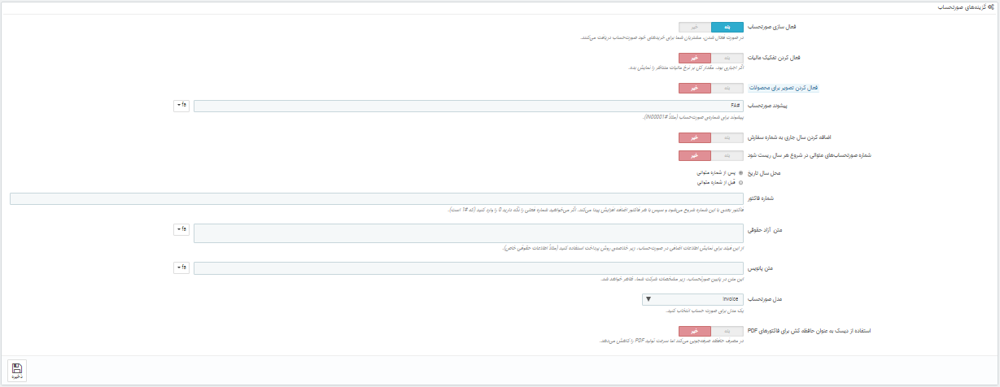

# فاکتورها

**فاکتور ها**

هربار که سفارشی در فروشگاه شما انجام شود، یک فاکتور به مشتری ارسال میشود.

این صفحه امکان پیکربندی فاکتورهای خود و همچنین انتخاب یک فاکتور برای دانلود را به شما میدهد.

**تولید فاکتور در یک فایل PDF**

شما میتوانید فاکتورهای یک سفارش را از صفحه سفارش دانلود کنید.

(**مورد تایید**)صفحه "فاکتورها" شما را قادر میسازد تا فاکتورهای مربوط به سفارشات قدیمی را در قالب PDF و هم زمان دانلود کنید (مشابه فایل PDF).

.png>)صفحه "فاکتورها" شما را قادر میسازد تا فاکتورهایی را که از سفارشات قدیم انتخاب میکنید را در قالب PDF دانلود کنید، در یک زمان (مشابه فایل PDF).

.png>)

شما میتوانید یک فایل PDF که حاوی چندین فاکتور است با دو معیار اصلی دریافت کنید:

* **(مورد تایید) با تاریخ**. زمانی که شما به چاپ فاکتور های یک ماه یا یک ربع از ساعت نیاز داشته باشید بسیار مفید است. کافی است تاریخ شروع و پایان را انتخاب و روی دکمه "تولید فایل PDF با تاریخ" که در نوار بالا قرار دارد کلیک کنید.

هنگامی که شما به پرینت کل فاکتورها در یک ماه خاص یا یک ربع از ساعت نیاز داشته باشید، بسیار مفید است. تاریخ شروع و پایان را انتخاب کنید، در نوار بالا بر روی دکمه "تولید فایل PDF با تاریخ" کلیک کنید.

* **(مورد تایید) با وضعیت سفارش**. زمانی که به چاپ سفارشاتی با وضعیتی مشخص مانند : لغو شده، بازپرداخت شده یا برگشی نیاز داشته باشید مورد استفاده قرار میگیرد. پرستاشاپ تعداد فاکتور های مربوط به هروضعیت را داخل پرانتز نمایش میدهد.

هنگامی که شما به پرینت دقیقی از سفارشات لغو شده، بازپرداخت شده یا بازگشتی نیاز دارید. پرستاشاپ به خوبی تعداد فاکتورهای مربوط به هر وضعیت را در پرانتز نشان می دهد.

(**مورد تایید**) در هر دو صورت فاکتور ها در صفحات مربوط به خودشان در قالب PDF تولید میشوند. شما نمیتوانید PDF های مستقلی از یک فاکتور که مربوط هر دوره یا وضعیتی که هستند دریافت کنید.

در هر دو صورت، فاکتور ها در یک فایل PDF تولید میشوند، هر کدام با صفحات خودشان. شما نمیتوانید برای هر فاکتور یک فایل PDF از هر دوره یا وضعیت در این صفحه استفاده کنید.

اگر شما میخواهید ظاهر فاکتورهای فروشگاه تان را شخصی سازی کنید، باید فایل های قالب آن را تغییر دهید.

PDF فایل های قالب در پوشه /pdf قرار دارند. فایل invoice.tpl را باز و آن را به دلخواه خود ویرایش کنید: این یک فایل HTML با برچسب های Smarty است.

زمانی که مشتریان از شما برای فاکتورهایشان میپرسند، میتوانید آنها را به بخش "تاریخچه سفارشات" در حساب کاربری شان هدایت کنید، که تمام فاکتورها در آنجا قابل دسترس است.

**گزینه های فاکتور**

شما میتوانید تعیین کنید که آیا فاکتورها بلافاصله بعد از ایجاد سفارش در دسترسی مشتریان قرار بگیرد، یا بهتر است شماره و پیش فاکتور در نسخه چاپی لحاظ شود. این ویژگی میتواند به سادگی به شما برای مدیریت حساب کاربری تان کمک کند.

* **فعال کردن فاکتور های**. زمانی که این گزینه غیرفعال باشد مشتری بعد از خرید فاکتور را دریافت خواهد کرد. چنانچه مشتری خواستار فاکتور باشد شما مسئول رسیدگی به آن هستید.
* **فعال کردن تجزیه و تحلیل مالیات**. در نسخه 1.6 زمانی که این گزینه فعال باشد، تخفیف های مختلف به همه فاکتور ها در سفارش اعمال میشود حتی 1درصد.
* **فعال کردن تصویر محصول**. در نسخه 1.6.1 زمانی که این گزینه فعال باشد، در فاکتور بعد از نام تصویر محصول اضافه خواهد شد.
* **پیشوند فاکتور**. در حالت پیش فرض، پرستاشاپ دارای پیشوندهای متناسب با زبان است: "IN" در انگلیسی، "FA" در فرانسوی (برای "facture")، "CU" در اسپانیایی (برای "cuenta") وغیره. شما میتوانید از کدهای زبان بجای آن استفاده کنید: "EN"، "FR"، "SP"، غیره. همچنین میتوانید انتخاب کنید که برای همه زبان ها دارای یک پیشوند باشد یا نه.

سپس پرستاشاپ متناسب با تنظیمات شما شماره فاکتور ها را تولید میکند: "#IN000001"، "#FA000002"، غیره.

* **افزودن سال جاری در شماره فاکتور**. علاوه بر شماره و پیش شماره، سال هم در فاکتور نمایش داده خواهد شد.
* **شماره پیشرونده فاکتور را در ابتدا سال بازنشانی کنید**. در شروع سال جدید، شماره فاکتور دوباره از صفر بازنشانی میشود.
* **موقعیت تاریخ سال**. انتخاب کنید تا در شماره فاکتور، تاریخ سال کجا نمایش داده بشه. قبل یا بعد از شماره پیشرونده.
* **شماره فاکتور**. قبل از استفاده از پرستاشاپ اگر سفارش و فاکتوری در تجارتتان داشتید میتوانید از این گزینه استفاده کنید تا شماره فاکتورها از بالاترین شماره شروع شود.
* **متن حقوقی آزاد**. در نسخه 1.6.1.0 این فیلد به شما اجازه میدهد تا برخی از مطالب اضافی را به فاکتور اضافه کنید، در صورتی که قوانین محلی شما نیاز به نمایش اطلاعات اضافی داشته باشد. در فاکتور، در زیر خلاصه روشهای پرداخت نمایش داده می شود. البته، شما میتوانید از این متن آزاد برای نمایش هرگونه متن مورد نظر خود استفاده کنید.
* **متن پاورقی**. شما با استفاده از این گزینه میتوانید در پایین همه فاکتورها متن سفارشی داشته باشید. این متن در پایین نام فروشگاه تان در فاکتور ظاهر خواهد شد.
* **مدل فاکتور**. متعلق به قالب شماست، ممکن است شما قادر به استفاده بیشتر از یک استایل برای فاکتور باشید. برای انتخاب یکی از آنها که ترجیح میدهید، با یک سفارش ساختگی تست کنید. اگر شما با نحوه کدگذاری در HTML آشنایی دارید، میتوانید مدل فاکتور خودتان را اضافه کنید و یا از مسیری که پرستاشاپ را نصب کردید در پوشه /pdf/ آن را ویرایش کنید.
* **از دیسک به عنوان حافطه پنهان(کش) برای فاکتورهای PDF استفاده کنید**. شما میتوانید فاکتورهای تولید شده را بجای حافظه نهان سرور در دیسک سرور پرستاشاپ ذخیره کنید. درحالی که در مصرف حافظه صرفه جویی میکند، تولید PDF را کند میکند بنابراین آگاهانه از آن استفاده کنید.

هرگز فراموش نکنید که تغییرات خود را ذخیره کنید.
