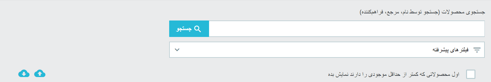
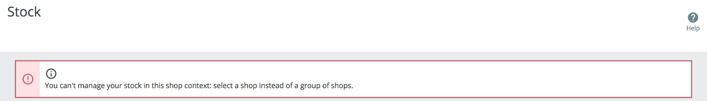
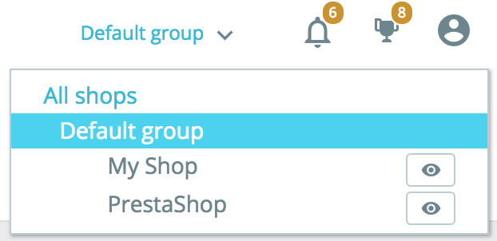

# نمای کلی موجودی

نمای کلی موجودی

این صفحه حاوی یک جدول است که موجودی محصولات شما و همچنین گزینه های جستجو را نشان می دهد و به شما این امکان را می دهد تا به طور مستقیم مقادیر محصولات خود را ویرایش کنید.

.png>)

یک جدول به شما امکان می دهد تا از یک نگاه کلی از موجودی فروشگاه خود داشته باشید.

.png>)

هر خط یک محصول را نمایش میدهد (استاندارد ، مجازی یا بسته نرم افزاری)یا یکی از ترکیبات آن را نشان می دهد. تنها تفاوت این است که ویژگی های ترکیبی دقیقاً زیر نام محصول نمایش داده می شوند.

این جدول شامل ستون های زیر است:

* تصویر بند انگشتی برای کمک به شناخت سریعتر بصری
* نام محصول و هنگامی که ترکیبی است، ارزش ویژگی های آن.
* مرجع محصول. در صورتی که ترکیبی مرجع خاص خود را داشته باشد ، از آن به جای مرجع والد استفاده می شود.
* تامین کننده. در صورتی که چندین تأمین کننده به یک محصول اختصاص یافته باشند، فقط تأمین کننده پیش فرض در اینجا نشان داده می شود.
* وضعیت ، برای دانستن اینکه آیا این محصول فعال است یا خیر.
* **موجودی فیزیکی** ، که بیانگر مقداری است که در واقع از نظر فیریکی در انبار خود دارید.
* **موجودی رزرو شده،** که نشان دهنده مقدار محصولاتی است که در حال حاضر در سفارش باز مشتری قرار دارد و هنوز ارسال نشده اند.
* **موجودی در دسترس**، که همان مقدار موجود برای فروش است.
* ویرایش مقدار. این ورودی اجازه میدهد تا مقدار را به صورت دستی تغییر دهید. در زیر مشاهده کنید:


**درک مفهوم موجودی فیزیکی ، رزرو شده و در دسترس است**

با شروع از نسخه 1.7.2.0 ، پرستاشاپ سه مفهوم مختلف از موجودی را معرفی می کند ، که از آنچه در نسخه های 1.6 در مدیریت موجودی پیشرفته استفاده می شد ، متفاوت است.

* **موجودی فیزیکی** نشان دهنده مقداری است که در واقع در انبار خود دارید. به عنوان مثال هنگام دریافت سفارش از تأمین کننده و یا هنگام تنظیم موجودی، می توانید موجودی فیزیکی را اضافه یا حذف کنید.&#x20;
* &#x20;**موجودی رزرو شده** بیانگر مقدار محصولاتی است که هم اکنون در سفارش باز مشتری قرار دارد که هنوز ارسال نشده است. به عبارت دیگر، این محصولات از نظر فیزیکی در انبار شما وجود دارند اما دیگر برای فروش در دسترس نیستند. شما نمی توانید موجودی رزرو شده را مستقیماً تغییر دهید. موجودی رزرو شده فقط به سفارشات مشتری بستگی دارد.
* **موجودی در دسترس** مقدار در دسترس برای فروش است. برخلاف مدیریت موجودی پیشرفته در ورژن 1.6 شما نمیتوانید به صورت مستقیم موجودی در دسترس رو تغییر دهید مگر آنکه موجودی فیزیکی را نیز تغییر داده باشید. این مقدار در صفحه "محصول" نمایش داده** **میشود.



**رابطهی بین موجودی فیریکی، رزرو شده و در دسترس**

در هر زمان ، این 3 مفهوم از موجودی، توسط معادله زیر بهم مرتبط هستند:

&#x20;موجودی فیزیکی - موجودی رزرو شده = موجودی در دسترس

ویرایش موجودی فیزیکی نیز بر موجودی در دسترس تأثیر خواهد گذاشت و برعکس.


به طور پیش فرض، محصولات با کاهش product\_id طبقه بندی میشوند، به این معنی که جدیدترین محصول ایجاد شده در صدر قرار خواهد گرفت. اگر بیش از 100 محصول و ترکیب وجود داشته باشد، این جدول صفحه گذاری می شود.

**ویرایش مقادیر**

مقادیر را می توان به طور مستقیم در صفحه "stock" از قسمت ورودی، واقع در ستون سمت راست از جدول نمای کلی موجودی تغییر داد.

ویرایش ساده

برای ویرایش موجودی یک محصول، کافی است مقدار مورد نظر را در قسمت ورودی وارد کنید. آنچه شما در این ورودی تایپ میکنید دلتا مقدار است، به این معنی که ارزش نهایی موجودی مورد نظر نیست بلکه مقداری است که اضافه یا حذف میکنید. میتوانید در فیلد مقدار، اضافه یا حذف کردن را (با یک علامت منفی) تایپ کنید یا از فلش های بالا و پایین برای تنظیم مقدار استفاده کنید.

.png>)

برای اعتبارسنجی موجودی جدید ، کافی است بر روی دکمه آبی "Check" در قسمت ورودی کلیک کنید یا از دکمه "اعمال مقدار جدید" در بالای جدول نمای کلی سهام استفاده کنید.

در حین ویرایش کمیت ، یک نمای کلی از موجودی نهایی حاصل را مشاهده می کنید:

.png>)

این ویژگی در اینجا به شما کمک میکند تا در یک زمان نقطه شروع، نقطه پایانی و تفاوت بین این دو را قبل از اعتبارسنجی ببینید. به یاد داشته باشید از آنجا که موجودی فیزیکی و در دسترس همیشه با معادله نشان داده شده در گذشته بهم مرتبط هستند، هر دو را به طور همزمان باهم ویرایش میکنید.

ویرایش متعدد

اگر می خواهید چندین مقدار را همزمان ویرایش کنید، می توانید مقادیر چند محصول را ویرایش کنید و سپس با دکمه "اعمال مقدار جدید" را به آن ها اعتبار دهید.

ویرایش حجیم

از زمان پرستاشاپ 1.7.3 اطلاعات موجودی محصول، می تواند به جای یک به یک به صورت عمده به روز شود. و این بسیار آسان است ، تنها کاری که شما باید انجام دهید این است که (در ستون سمت چپ) تمام محصولاتی را که می خواهید ویرایش کنید بررسی کنید، مقدار مورد نظر را برای اضافه کردن یا کم کردن به موجودی در دسترس وارد و تأیید کنید!

هشدارهای موجودی کم

هنگامی که یک محصول در انبار به اندازه کافی موجود نیست ، می توانید از پرستاشاپ بخواهید تا هشدارهایی برای شما ارسال کند. می توانید آستانه کم بودن موجودی را بصورت کلی در صفحه "محصول" یا برای هر محصول به صورت جداگانه تنظیم کنید. و سپس ، در این صفحه نمای کلی موجودی ، محصولات با مقدار کمتر از تعریف شده، برجسته شده اند. یک فیلتر سریع نیز اضافه شده است که به شما امکان می دهد با قرار دادن آنها در بالای لیست ، به سرعت محصولات با موجودی کم را مشاهده کنید.

.png>)

**گزینه های جستجو و فیلتر**

در بالای صفحه شما دو امکان برای پیدا کردن سریع تر محصولات میبینید. نوار جستجو برای مواردی طراحی شده است که شما مرجع، نام یا تامین کننده محصولی را که به دنبال آن هستید میدانید. در حالی که فیلترهای پیشرفته به شما امکان می دهند تا گزینه های بیشتری را برای تنظیم دقیق جستجوی خود پیدا کنید.

نوار جستجو

نوار جستجو به دنبال:

* نام محصول
* مرجع محصول
* تامین کننده
* **{بتا در صورت استفاده از 1.7.2.0}** ارزش مقادیر . این به شما امکان می دهد به دنبال یک ویژگی خاص مانند رنگ باشید. هنگام تایپ "سبز" ، همه محصولاتی را مشاهده می کنید که این مقدار ویژگی را به اشتراک می گذارند. با این حال ، این هنوز در بتا است ، و ممکن است با مقادیر صفت خیلی کوتاه مانند اندازه ها کار نکند: "S" ، "M" ، "L".

فیلتر پیشرفته

در صفحه "Stock"، فیلتر پیشرفته شامل:

* فیلتر تامین کننده، که به شما این امکان را میدهد تا به سرعت تامین کنندگان در دسترس را پیدا کرده و یک یا چندتا را انتخاب کنید.
* فیلتر شاخه بندی با درخت قابل گسترش

واردسازی/ خروجی

از آنجا که فروشگاه شما با داده های زیادی سرو کار دارد ، پرستاشاپ به شما این امکان را میدهد تا اطلاعات نمایش داده شده در صفحه نمای کلی موجودی را در یک فایل CSV وارد یا خارج کنید. چرا؟ تا بتوانید با کامپیوتر خود روی آن کار کنید، به سیستم مدیریت موجودی خود متصل شوید ... هرکاری که بخواهید! شما فقط باید روی نمادهای ابر آبی در سمت راست صفحه کلیک کنید و به سیستم واردسازی یا خروجی گرفتن وارد شوید.

**چندفروشگاهی**

این سیستم مدیریت جدید موجودی با چند فروشگاهی سازگار است. به دلایل واضحی ، اگر چندین فروشگاه در داخل یک گروه دارید که موجودی آنها به اشتراک گذاشته نمیشود، نمیتوانید موجودی خود را در زمینه "همه فروشگاه ها" یا "گروه" مدیریت کنید. اگر سعی در انجام این کار دارید، ممکن است پیام خطای زیر را مشاهده کنید:

در عوض شما باید فروشگاهی را انتخاب کنید که در آن بتوانید برای ویرایش موجودی آن کار کنید.

اگر از گروه فروشگاه هایی استفاده می کنید که مقادیر یکسانی را به اشتراک میگذارند، لازم است به جای گروه، زمینه فروشگاهی منحصر به فرد را انتخاب کنید اما هر تغییری که در یک فروشگاه ایجاد می کنید روی سایر قروشگاه ها نیز تأثیر می گذارد.

