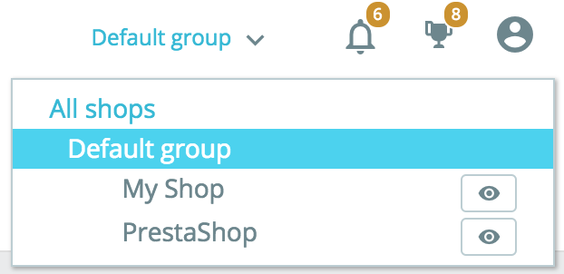

# قالب و لوگو

**قالب و لوگو**

عنوان آن بیانگر توضیح صفحه است: صفحه "قالب و لوگو" شما را میسازد قالبهای خود را به صورت کارآمد مدیریت کنید و همچنین از این بخش میتوانید لوگوی خود را نیز بروز رسانی کنید.

* انطباق با زبان های راست به چپ
* آرم ها
  * طرح بندی صفحه خود را پیکربندی کنید
  * یک موضوع را برای فروشگاه "\[name\]" خود انتخاب کنید.
  * افزودن یک قالب
  *  استخراج یک قالب
  * استفاده از آنلاین از addons پرستاشاپ
* پیکربندی صفحه اصلی
* سفارشی سازی پیشرفته: موضوع والدین / کودک
  * ایجاد تم کودک

  
**انطباق با زبان های راست به چپ**

 این مورد از پرستاشاپ 1.7.3 اصافه شده است. پرستاشاپ از زبان های راست به چپ \(rtl\) پشتیبانی میکند. نه تنها صفحه مدیریت و قالب های آن به صورت کامل با rtl سازگار هستند بلکه ما در حال معرفی نسل سبک های RTL برای کاربری نیز هستیم. این به این معنی است که قالب کاربری به صورت خودکار میتواند به راست به چپ تبدیل شود. این امر برای فروش در کشور هایی زبان آنها راست چین است مانند عربی یا فراسی بسیار مهم است.

**لوگو**

تغییر آرم فروشگاه شما اغلب یکی از اولین مراحل انجام شخصی سازی طراحی فروشگاه شما است. به کمک این سه زبانه مختلف میتوانید آرم اصلی فروشگاه خود را اصلاح کنید اما نه تنها:

* **لوگوی سربرگ.** آرمی که در تمام صفحات فروشگاه شما نشان داده می شود.
* **لوگوی رایانامه و لوگوی فاکتور.** آرم هایی که به ترتیب در اعلان ها و فاکتورهای ایمیل فروشگاه شما نشان داده می شوند.
* **شمایل مورد علاقه.** فروشگاه مورد علاقه شما. این تصویر کوچکی است که در سمت چپ نوار آدرس مرورگر وب و در برگه های مرورگر نمایش داده می شود.


قالب پیش فرض از لوگوی "کلاسیک" و لوگوی پرستاشاپ به عنوان نماد استفاده می کند. اکیداً توصیه می شود همه موارد این آرم ها را تغییر دهید و به جای آن از لوگوی خود استفاده کنید!



در حالت چندفروشگاهی، با استفاده از منوی چند فروشگاهی می توانید این تغییرات را همزمان در همه فروشگاهها یا گروهی از فروشگاه ها اعمال کنید.


**قالب فعلی شما**

بخش اول این صفحه با جزئیات آن یادآوری می کند که در حال حاضر از کدام موضوع استفاده می کنید:

* نام و نسخه قالب
* نام طراح قالب
* ایجاد بند انگشتی برای قالب

**چیدمان های صفحه ی خود را پیکربندی کنید.**

بسته به گزینه های قالب خود می توانید هر نوع طرح بندی صفحه را سفارشی کنید: مانند اینکه آیا باید ستون داشته باشد یا خیر، چند ستون و با چه اندازه هایی و غیره. با کلیک بر روی "انتخاب چیدمان" ، صفحه جدیدی مشاهده خواهید کرد که در آن انواع صفحات موجود در سایت شما \(شاخه ها، محصول جدید، سبد خرید و غیره\) لیست شده است. برای هر صفحه می توانید چیدمان پیش فرض را تغییر دهید.

برای قالب پیش فرض پرستاشاپ ، Classic "" ، گزینه های موجود عبارتند از:

* عرض کامل - بدون هیچ ستونی در اطراف، ایده آل برای صفحات بدون موارد کناره مانند صفحات محصول.
* سه ستون - یک ستون مرکزی بزرگ و 2 ستون کناری.
* دو ستون ، ستون سمت چپ کوچک - دو ستون با یک ستون سمت چپ کوچک.
* دو ستون ، ستون سمت راست کوچک - دو ستون با یک ستون کوچک راست.

بر روی "ذخیره" برای اعمال تغییرات کلیک کنید. در صورتی که می خواهید تغییرات خود را برگردانید و به تنظیمات پیش فرض برگردید ، کافیست روی دکمه "بازنشانی به حالت پیش فرض" در صفحه "طرح زمینه و نشان" کلیک کنید.

**انتخاب یک قالب برای فروشگاهتان**

این بخش فقط درصورتی نمایش داده شده میشود که شما حداقل دو قالب نصب شده داشته باشید. به شما دیگر قالب های موجود در پرستاشاپ نصب شده ی شما را بجز قالب فعال شما، نمایش میدهد.

این بخش، تصویر بندانگشتی از قالب موجود و نام آن را نشان میدهد. موس خود را بر روی تصویر بندانگشتی برای نمایش منویی با دو گزینه ببرید:

* **استفاده از این قالب.** این گزینه، قالب را جایگزین قالب فعلی شما میکند.
* **حذف این قالب.** این گزینه فایل قالب را از وب سرور شما حذف میکند.


در حالت چند فروشگاهی، نمی توانید قالبی را برای همه فروشگاهها یا گروهی از فروشگاهها اعمال کنید. شما باید یک فروشگاه واحد را از فهرست چند فروشگاهی انتخاب کنید ، سپس یک تم را انتخاب کنید.


**اضافه کردن قالب**

به کمک دکمه "اضافه کردن قالب جدید" میتوانید قالب \(و ماژولهای همراه آن\) را وارد و نصب کنید. با کلیک بر روی آن، صفحه جدیدی باز میشود. این صفحه 3 روش برای نصب یک تم جدید به شما ارائه میدهد. یک دکمه نهایی شما را به فرم ایجاد تم هدایت میکند، که در بخش بعدی ارائه شده است.

هر روشی را که انتخاب کنید، پروسه یکسان است: محل وارد کردن فایل فشرده zip را نشان میدهد و سپس بر روی گزینه ذخیره کلیک کنید. در اینجا تنها چیزی که تغییر میکند منبع فایل zip است:

* **وارد سازی از کامپیوترتان.** از مرورگر برای پیدا کردن فایل استفاده کنید.
* **وارد سازی از اینترنت.** آدرس مستقیم url را وارد کنید.
* **وارد سازی از FTP.** با استفاده از FTP مشتری ، فایل را در پوشه زیر بارگذاری کنید:

 / themes /.

برای تأیید انتخاب خود ، "ذخیره" را کلیک کنید: قالب اکنون نصب شده است. برای بار آخرین روی گزینه "ذخیره" کلیک کنید. صفحه تأیید نهایی ، تمام تغییرات اعمال شده در نصب پرستاشاپ را به شما نشان می دهد. برای پایان دادن به روند "پایان" را کلیک کنید.

**استخراج یک قالب**

این بخش فقط زمانی در دسترس است که حداقل یک قالب در سایت پرستاشاپ شما نصب شده باشد. استخراج یک قالب برای زمانی که میخواهید یک بک آپ از قالب برای ایمن سازی تهیه کنید و هنگام ایجاد یک آرشیو از قالب برای دوست ایجاد کنید و یا بخواهید قالب را در بازارچه addons در دسترس قرار دهید. نه تنها یک فایل zip کامل از قالب شما تهیه میکند بلکه ماژولهای سفارشی که در قالب شما اضافه شده نیز ذخیره میشوند که هم هنگام بارگذاری در addons و هم هنگام وارد کردن آن به یک سایت پرستاشاپ دیگر مفید است.

گزینه استخراج فقط برای قالب فعلی کار میکند. برای استخراجی قالبی که در حال استفاده در فروشگاه است گزینه "استخراج قالب فعلی" را کلیک کنید. قالب شما در یک فایل .zip فشرده میشود و پیام تاییده به شما آدرس قالب در پوشه را میدهد. فایل را بر روی هارد دیسک خود ذخیره کنید تا ایمن باشد. از آنجا به بعد میتوانید به راحتی این قالب را با دیگران به اشتراک بگذارید و اگر این قالب حاصل خلاقیت خودتان است، میتوانید شروع به فروش آن در بازارچه addonsکنید.

**آنلاین از addons پرستاشاپ**

اگر به دنبال قالب جدید هستید، به addons پرستاشاپ مراجعه کنید! به کمک این بخش میتوانید محبوب ترین قالب ها را بررسی کنید و از آنها الهام بگیرید. با کلیک بر گزینه "اکتشاف" برای یک قالب صفحهی جدیدی از addons پرستاشاپ باز میشود که جزییات بیشتری آن قالب خاص میدهد. همچنین می توانید از نوار جستجو در پایین صفحه استفاده کنید تا موضوعی را که برای فروشگاه شما مناسب است پیدا کنید.

پیکربندی صفحات

این مورد از پرستاشاپ 1.7.4 اصافه شده است! این یکی از ویژگی های اخیر است که ما به آن افتخار می کنیم: نقشه کشی صفحه اصلی! از آنجایی که هر قست از صفحه کاربری به یک ماژول خاص اختصاص دارد، هر تغییر کوچکی مربوط به یک ماژول در صفحه مدیریت است که نیاز هست تا به پیکربندی ماژول دسترسی پیدا کنیم.... این بصری نیست درست است؟ در حال حاضر نقشه کشی صفحه این امکان را فراهم میسازد تا یک نمایش دوگانه برای شخصی سازی سریع تر قالب و همچنین تجارت موفق تری داشته باشیم

در ستون سمت چپ، تصویری از صفحه اصلی شما را قادر به پیدا کردن قسمتی که میخواهید تغییر دهید میکند. با استفاده از این چهارچوب قالب، یک نسخه ساده از بخش کاربری پرستاشاپ ایجاد میشود. در سمت راست ، یک نمای منعکس شده از ماژول های انتخابی را نشان میدهد که نیاز به اصلاح دارند.

صفحه اصلی ما به 7 دسته مختلف تقسیم شده است: منو، اسلایدر، محصولات خانگی، بلوک متن، خبرنامه و شبکه های اجتماعی، بنر و پاورقی. هر شاخه یک تب است که میتواند برای ویژگی های مرتبط در هسته و ماژول های بومی نمایش داده شود. ویژگیها میتوانند نصب، پیکربندی یا غیرفعال شوند. توجه داشته باشید که با کلیک بر روی دکمه "پیکربندی" بازرگان به صفحه پیکربندی ویژگی هدایت می شود.

Advanced customization: parent / child theme

این یک ویژگی است که با پرستاشاپ 1.7معرفی شده است و تنها در صورتی مفید است که بخواهید قالب را کمی تغییر دهید \(برای مثال یک بلوک اضافه کنید\)، اما مطمئن شوید که می توانید آن را به راحتی به روز کنید. در واقع ، اگر قالبی را مستقیماً در پوشه آن تغییر دهید ، خطر این است که هنگامی که قالب بروز رسانی شد، تغییرات میتواند با بروزرسانی ناسازگار باشد.

به کمک قالب فرزند، شما میتوانید قالب والد را شخصی سازی کنید و در عین حال میتوانید از به روزرسانیهای آن بهره مند شوید.


استفاده از قالب فرزند می تواند کمی فنی باشد. برای دیدن نحوه استفاده از قالب فرزند با جزئیات، لطفاً به اسناد زیر مراجعه کنید:

[https://devdocs.prestashop.com/1.7/themes/reference/template-inheritance/parent-child-feature/](https://devdocs.prestashop.com/1.7/themes/reference/template-inheritance/parent-child-feature/)


**ایجاد قالب فرزند**

ابتدا باید قالب را که میخواهید به عنوان والد استفاده کنید را به عنوان والد در پوشه فروشگاه/ تم داشته باشید. سپس میتوانید یک پوشه جدید با قالبی کمین ایجاد کنید، که فقط شامل فایلهایی باشد که میتوانید به صورت مستقیم از پوشه قالب والد کپی کنید:

پس از استفاده از این موضوع، در قالب فرزند خود تعیین خواهید کرد که کدام قالب باید به عنوان والد استفاده شود \(در مثال زیر، قالب پیش فرض پرستاشاپ، Classic\) را انتخاب کردیم. مقدار باید نام فنی موضوع باشد \(یعنی: نام پوشه تم\). اطلاعات زیر را به فایل theme.yml اضافه کنید:

اکنون می توانید از این قالب در مدیریت خود استفاده کرده و آن را به دلخواه ویرایش کنید.


آیا قالب هایی که طراحی میکنید آنقدری خوب هستند که دیگر تاجران برای آن هزینه بپردازند؟ میتوانید آن را در addons ، بازارچه رسمی قالب و ماژول پرستاشاپ بفروشید.


