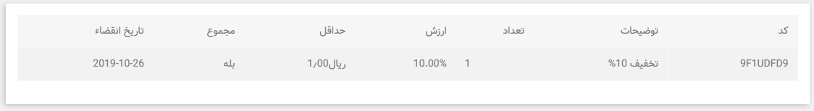

# واحدهای پول

**واحدهای پول**

پرستاشاپ تعداد زیادی از واحدهای پول را پشتیبانی میکند. به طور پیش فرض ، فقط یک ارز برای فروشگاه شما ثبت شده است ، یعنی واحد پول کشور پیش فرض فروشگاه شما. با این حال، می توانید واحدهای پول جدید را بسته به نیاز مشتریان خود اضافه و پیکربندی کنید. در واقع ، مشتریان از اینکه می توانند با ارز شخصی خود خرید کنند قدردانی می کنند!

تغییر ارز پیش فرض

تمام واحد های پول اضافه شده \(رسمی یا جایگزین\) از یک واحد ارز پیش فرض فروشگاه محاسبه می شوند. به همین دلیل ارز پیش فرض باید ارزی باشد که با آن راحت تر باشید.

برای تغییر ارز پیش فرض فروشگاه خود:

1. به منوی بین الملل، صفحه بومی سازی بروید.
2. "واحد پول پیشفرض را در بخش پیکربندی پیدا کنید.
3. واحد پول پیشفرض مورد نظر خود را تنظیم کنید.

اگر ارزی که می خواهید به عنوان پیش فرض تنظیم کنید موجود نیست ، باید آن را اضافه کنید چه با وارد کردن بسته بومی سازی کشوری که از آن ارز استفاده میکند و یا با تکمیل فرم "افزودن ارز جدید" \(به "افزودن ارز جدید" مراجعه کنید\).

افزودن ارز جدید

دو روش برای اضافه کردن ارز جدید وجود دارد:

1. بسته بومی سازی کشوری که از آن ارز استفاده میکند را وارد کنید.

این کار را می توان در صفحه "بومی سازی" از منو "بین المللی" انجام داد.

به عنوان مثال ، اگر می خواهید دینار الجزایر را اضافه کنید ، می توانید بسته بومی سازی Algeria’s را وارد کنید.

هنگام وارد کردن بسته بومی سازی ، زبان به طور پیش فرض فعال می شود. پس از وارد کردن ، می توانید وضعیت ارز را در صفحه "ارزها" مدیریت کنید.

 2. واحد پول را به صورت دستی اضافه کنید.

بر روی دکمه "افزودن واحد پول جدید" کلیک کنید. ارزی را که می خواهید اضافه کنید از لیست انتخاب کنید. بخش های فرم به طور خودکار پر می شوند.

به طور پیش فرض ، ارز غیرفعال است. برای فعال کردن آن در فروشگاه خود ، فراموش نکنید که دکمه وضعیت را به "بله" تغییر دهید و ذخیره کنید.

ایجاد ارز جایگزین

ممکن است لازم باشد ارزی را اضافه کنید که در هیچ یک از بسته های بومی سازی وجود ندارد یا در لیست زبان ها موجود نیست. از این ویژگی برای افزودن رمز ارز ، ارز محلی و غیره که نیازهای مشتریان شما را برآورده می کند استفاده کنید \(این گزینه در نسخه های 1.7.7 به بعد موجود است.\)

1. بر روی دکمه "افزودن واحد پول جدید" کلیک کنید.
2. کادر "ایجاد ارز جایگزین" را علامت بزنید
3.  بخش های فرم را پر کنید:

* * **نام ارز.** نام واحد پول را وارد کنید.
  * **کد ISO.** کد ISO 4217 ارز را وارد کنید. برای اطلاعات بیشتر به ویکی پدیا مراجعه کنید. همچنین می توانید کدهای ISO غیر رسمی ارزهای جایگزین مانند بیت کوین را پیدا کنید.
  * **نرخ ارز.** این نرخ باید براساس ارز پیش فرض فروشگاه شما تعریف شود. به عنوان مثال ، اگر ارز پیش فرض یورو باشد و ارز انتخابی شما دلار باشد ، "1.20" را تایپ کنید \(1 یورو = 1.20 دلار\).
  * **اعداد اعشاری.** تعداد ارقام زیر رقم اعشار برای قیمتهای فروشگاه شما.
  * **وضعیت.** هر ارزی می تواند در هر زمان غیر فعال شود ، هم از صفحه ویرایش و هم از لیست ارزهای موجود در صفحه "ارزها". هنگامی که با استفاده از "افزودن فرم جدید ارز" ارز جدید ایجاد می کنید ، به طور پیش فرض غیرفعال می شود.

**ویرایش نمادها و قالب**

بسته به زبانهای فروشگاه خود \(هر دو نوع فعال و غیرفعال\) می توانید قالب و نماد هر ارز را شخصی سازی کنید.

هنگام ویرایش ارز ، در پایین صفحه ، زبانی را انتخاب کنید که می خواهید نماد ارز و یا قالب آن را اصلاح کنید و روی "ویرایش نماد / قالب" کلیک کنید.

نماد ارز را وارد کنید و قالب را انتخاب کنید:

* درست در مقابل مقدار ، به عنوان مثال 999.99 پوند
* در جلو با فاصله بین نماد و مقدار ، به عنوان مثال 999.99 پوند
* درست بعد از مقدار ، به عنوان مثال 999.99 پوند
* بعد از مقدار با فاصله بین آنها ، به عنوان مثال 999.99 پوند

با پر شدن قسمت "نماد" ، مربع سفید با نماد ارز جایگزین می شود.

لطفا توجه داشته باشید که این ویژگی فقط هنگام ویرایش ارز در دسترس است.

**به روزرسانی نرخ تبدیل ارزها**

نرخ تبدیل ارز یا نرخ تبدیل ، نرخی است که در آن یک ارز با ارز دیگر مبادله می شود. به عنوان مثال ، نرخ تبدیل EUR / USD 1،22 به این معنی است که 1 یورو برابر با 1،22 دلار است.

اگر کالایی 15 یورو باشد ، 18،30 دلار قیمت دارد. \(15 \* 1،22 = 18،3\)

برعکس ، اگر کالایی 15 دلار قیمت داشته باشد ، 12،30 یورو قیمت دارد. \(15 / 1،22 = 12،3\)


نرخ پرستاشاپ توسط بانک مرکزی اروپا ارائه می شود و هر روز به روز می شود. با این حال ، توجه داشته باشید که ممکن است کمی با نرخ فعلی متفاوت باشد زیرا این نرخ ها می توانند در مدت زمان کوتاهی نوسان زیادی داشته باشند.


فراموش نکنید که با دنبال کردن این مراحل ، مرتباً نرخ ها را به روز کنید:

برای به روزرسانی نرخ ارز:

1. به بخش «نرخ تبدیل» در صفحه «واحد های پول» بروید.
2. بر روی دکمهی "بروز رسانی" کلیک کنید.


نرخ ارزهای شخصی به طور خودکار به روز نمی شود ، بنابراین باید آنها را به صورت دستی به روز کنید. به عنوان مثال ، اگر بیت کوین را اضافه کردید و می خواهید نرخ ارز را به روز کنید ، روی ویرایش کلیک کنید تا واحد پولی ارز را تغییر دهید و نرخ ارز را در قسمت مربوطه وارد کنید. بنابراین ، برای ارزهای جایگزین بسیار ناپایدار ، توصیه می شود از ماژولی استفاده کنید که بتواند نرخ ارز را به طور خودکار به روز کند.


با کلیک بر روی دکمه "به روز رسانی" ، نرخ ارز ارز فروشگاه شما به طور خودکار به روز می شود. یک جستجوی ساده در اینترنت معمولاً برای یافتن نرخ تبدیل ارز کافی است. مبدل های زیادی در اینترنت وجود دارد که می توانید مانند XE.com از آنها استفاده کنید.

برای ارزهای دیجیتال میتوانید به وب سایتهای زیر مراجعه کنید: https://coinmarketcap.com/

