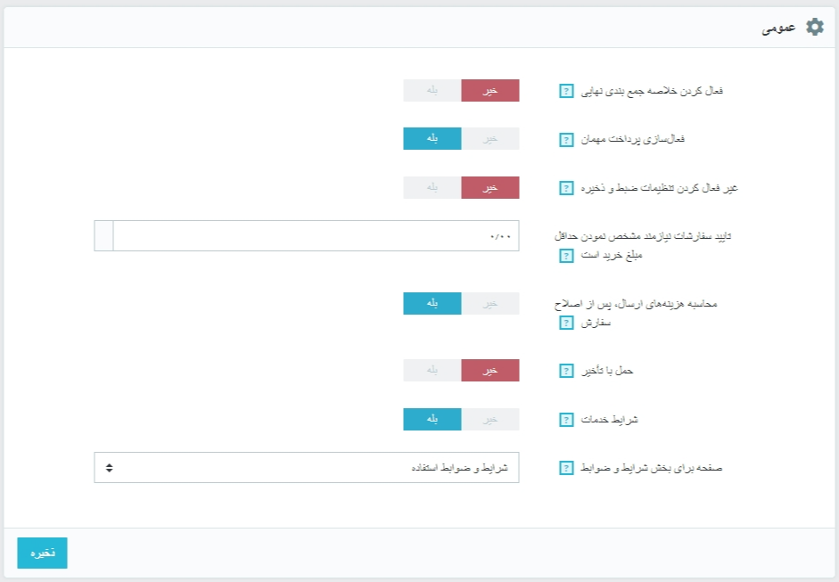

# تنظیمات سفارش

**تنظیمات سفارش**

تنظیمات صفحه "سفارشات" برای سفارشاتی که مشتریان شما انجام می دهند و همچنین به برخی دیگر از جزئیات مانند هدیه دادن. اعمال می شود.

**تنظیمات عمومی**




* **فعال کردن خلاصه جمع بندی نهایی.** همانطور که در برخی از کشورهای اروپایی لازم است شما هم ممکن است که نیاز داشته باشید که خلاصه سفارش \(سبد خرید، آدرس، روش تحویل،...\) را درست قبل از تایید سفارش نمایش دهید.
* **فعال سازی پرداخت مهمان.**  این گزینه امکان ثبت سفارش را برای بازدیدکنندگانی که در سایت ثبت نام نکرده اند و حساب کاربری ندارند فراهم می کند.
* **غیرفعال کردن تنظیمات ضبط و ذخیره.** اگر این گزینه روی "بله" تنظیم شده باشد، مشتریان با رفتن به صفحه تاریخچه سفارشات قادر به سفارش دوباره با یک کلیک نخواهند بود \( این گزینه در بعضی از کشورهای اروپایی نیاز می باشد: بنابراین شما این گزینه را غیرفعال کنید و آن را روی "بله" قرار دهید \).
* **تایید سفارشات نیازمند مشخص نمودن حداقل مبلغ خرید است.** این گزینه حداقل مبلغ سبد خرید را برای ارسال سفارش تعیین می کند. اگر مبلغ سفارش کمتر از این مقدار باشد مشتری قادر به تکمیل فرایند خرید خود نخواهد بود. اگر مایل به تنظیم حداقل مقدار نیستید، مقدار این فیلد را برابر با "0" قرار دهید
* **محاسبه هزینه‌های ارسال، پس از اصلاح سفارش.** این گزینه در پرستاشاپ 1.7 جدید است. این گزینه در هنگام ویرایش سفارش \(افزودن یک محصول، تغییر آدرس تحویل، و...\) به صورت خودکار هزینه های حمل و نقل را محاسبه می کند. همچنین امکان تغییر حامل را برای سفارشی که هنوز تایید نشده است را فراهم می کند و هزینه حمل و نقل را بروزرسانی می کند.
* **حمل با تاخیر.** اگر گزینه " اجازه ثبت سفارش بیش از موجودی محصول "را فعال کنید \(در صفحه تنظیمات محصول\)، به شما این اجازه را می دهید که در صورت نیاز، محصولات پس از موجود شدن ارسال شوند \(بسته به این که تیم شما آن را چگونه مناسب ببینند\). در ابتدا، پرستاشاپ سفارشات را در دو قسمت جدا خواهد کرد: اقلام موجود فرستاده می شوند در حالی که سایر اقلام در انتظار تا زمان موجود شدن در حال انتظار باقی می مانند.
* **شرایط خدمات.** قبل از تأیید سفارش مشتری باید شرایط خدمات را قبول کند.
* **صفحه برای بخش شرایط و ضوابط.** "شرایط و ضوابط استفاده" از فروشگاه شما رو می تونید در صفحه ی طراحی، صفحات مشاهده کنید. صفحه ای را بدین منظور انتخاب کنید تا پرستاشاپ آن را به درستی نمایش دهد.

**تنظیمات هدیه**

* **پیشنهاد کادوپیچی.** پرستاشاپ برای مشتریان خود پیشنهاد کادوپیچی و امکان افزودن پیام را فراهم کرده است.  این ویژگی خوبی برای افرادیست که تمایل دارند هدیه خود را از طریق فروشگاه ارسال کنند.
* **قیمت کادوپیچی.** در این فیلد هزینه خدمات کادوپیچی را تعیین کنید.
* **مالیات کادوپیچی.** در صورت نیاز، مالیات محلی برای این کادوپیچی را تعیین کنید.شما می توانید مالیات های بیش تری را از طریق صفحه " مالیات ها " در منوی "بین المللی" اضافه کنید.
* **پیشنهاد بسته بندی قابل بازیافت**.  اگر شما قادر به ارائه این سرویس باشید بسیاری از مشتریان قدردان شما خواهند کرد.

