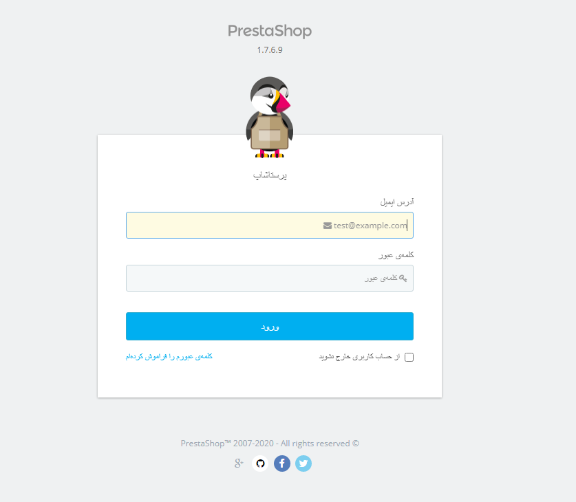
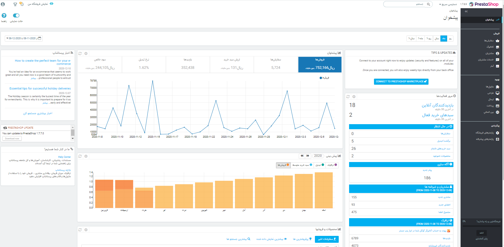

# ورود به بخش مدیریت پرستاشاپ

ورود با به بخش مدیریت پرستاشاپ

بخش مدیریت پرستاشاپ نامی است که برای توصیف صفحه مدیریت فروشگاه پرستاشاپ شما در این راهنمای کاربر استفاده شده است. شما بیشتر وقت خود را در این پنل خواهید گذراند، زیرا همه چیزهایی که کاربر مشاهده میکند مستقیماً از طریق مدیریت اداره میشوند: افزودن / ویرایش / حذف محصولات، بررسی حاملها، ساخت بسته، ایجاد کوپن، برقراری ارتباط با مشتریان ، بهبود فروشگاه و غیره.

در طول مراحل نصب ، به دلایل امنیتی ، پوشه `/admin` به چیزی منحصر به فرد تغییر نام می دهد \( به عنوان مثال `/admin091anufki`\).

از نام پوشه جدید برای دسترسی به فروشگاه خود استفاده کنید \(به عنوان مثال: [http://www.example.com/admin091anufki](http://www.example.com/admin091anufki)\).

تغییر نام به طور خودکار توسط پرستاشاپ انجام می شود. دقت داشته باشید اولین بار که پس از نصب به آن پوشه دسترسی پیدا کردید ، آن نام را بخاطر بسپارید!

صفحه ورود به کنترل پنل فروشگاه خود را مشاهده خواهید کرد.

آدرس ایمیل و رمز عبوری را که هنگام نصب پرستاشاپ با آن ثبت نام کردهاید وارد کنید. روی دکمه "ورود" کلیک کنید و به پیشخوان، اولین صفحه بخش مدیریت، منتقل میشوید.

 از این مرحله به بعد می توانید پیکربندی فروشگاه خود را آغاز کرده و محصولات را به مشتریان بفروشید.

بخش بعدی این راهنمای کاربر را با نام " [آشنایی با بخش مدیریت](http://doc.prestashop.com/display/PS17/Discovering+the+Administration+Area)" بخوانید تا با بخش های مختلف مدیریت آشنایی پیدا کنید.

